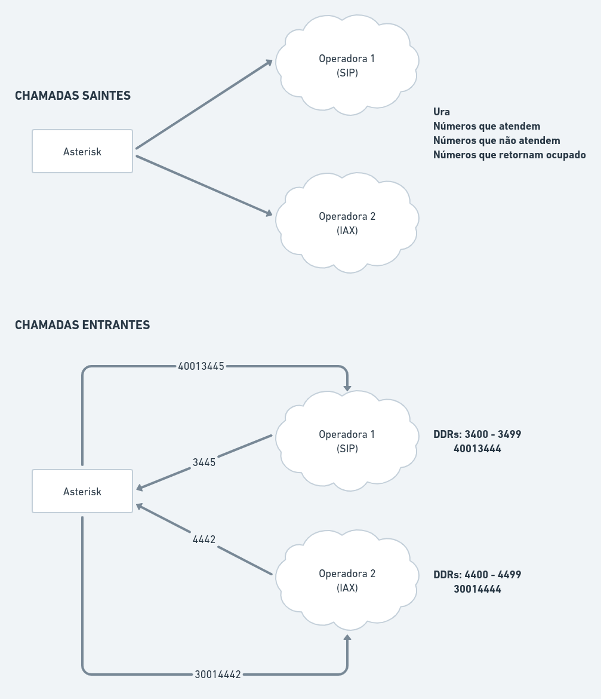

# Simulador de operadoras SIP e IAX

Este simulador servirá para estudar o funcionamento de configuração de entroncamentos SIP e IAX com seu servidor Asterisk. Ele dispõe 2 operadoras (uma SIP e outra IAX) que requerem autenticação e que possuem alguns números para teste retornando diferentes resultados (atendido, não atendido, não atendido, etc).

**Recomendações**

 - O simulador pode ser instalado dentro da mesma máquina onde o seu Asterisk está hospedado, ou fora. Caso esteja em ambiente de produção, é recomendado instalá-lo fora, para não impactar nenhum serviço, porém em amibente de testes/desenvolvimento recomenda-se instalá-lo na mesma máquina onde o asterisk se encontra para evitar problemas com NAT.

**Requisitos**

 - Docker >= 20.10.12
 - Docker-compose >= 1.29.2
 - Git >= 2.38.1
 - Make >= 4.3

**Arquitetura**




**Recursos**

 - É possível simular entroncamento com 2 operadoras Voip: uma SIP (operadora 1) e outra IAX (operadora 2).
 - Status retornados por alguns números:

|Número|Status|
|--|--|
|11987878787|Toca por 15 segundos e não atende|
|08007778080|A chamada é atendida por uma URA|
|12987878786| Número que não existe |
|12987878785| Caixa postal |
| * |Demais números retornam como ocupado |
 
  - Credenciais  da operadora 1

|Campos|Valores|
|--|--|
|Host|sip.operadora1.com.br|
|Porta|5080/UDP|
|Usuário|operadora-1|
|Senha|dd22c3a768b356e974613b2ea3d93681|
|Codecs|G711a,G711u|
|Número principal (bina)|40013434|
|Faixa DDR|3400-3499|

  - Credenciais  da operadora 2
   
|Campos|Valores|
|--|--|
|Host|iax.operadora2.com.br|
|Porta|4570/UDP|
|Usuário|operadora-2|
|Senha|99aa12e79ab46d65161c1fad83f4945a|
|Codecs|G711a,G711u|
|Número principal (bina)|30014444|
|Faixa DDR|4400-4499|


**Configuração do Voip Carrier Simulator**
 
1 - Baixar o projeto:

```shell
git clone https://github.com/beneditomarques/voip-carrier-simulator.git
cd voip-carrier-simulator
```

2 - Configurar o arquivo /etc/hosts **da máquina onde está instalado o servidor Asterisk**:

 - Caso o simulador esteja na mesma máquina que o Asterisk:
  
```shell
echo "127.0.0.1 sip.operadora1.com.br" >> /etc/hosts
echo "127.0.0.1 iax.operadora2.com.br" >> /etc/hosts
```

 - Caso o simulador esteja em outra máquina (neste exemplo o IP 192.168.100.200 é o da outra máquina):
  
```shell
echo "192.168.100.200 sip.operadora1.com.br" >> /etc/hosts
echo "192.168.100.200 iax.operadora2.com.br" >> /etc/hosts
```


3 - Realizar o build da imagem:

```shell
make build ver=1.0.0
```

4 - Inicializar o container:

```shell
make up
```

**Configuração no Asterisk**

 - sip.conf

```
register => operadora-1:dd22c3a768b356e974613b2ea3d93681@sip.operadora1.com.br:5080/SIMULADOR-OPERADORA1

[SIMULADOR-OPERADORA1]
type=friend
context = tronco-SIMULADOR-OPERADORA1
host = sip.operadora1.com.br
port=5080
nat = no
fromuser = operadora-1
qualify = yes
allow = !all,alaw,ulaw
```

 - iax.conf:

```
register => operadora-2:99aa12e79ab46d65161c1fad83f4945a@iax.operadora2.com.br:4570/SIMULADOR-OPERADORA2

[SIMULADOR-OPERADORA2]
type=friend
host=iax.operadora2.com.br
port=4570
trunk=yes
secret=99aa12e79ab46d65161c1fad83f4945a
context=tronco-SIMULADOR-OPERADORA2
```

 - pjsip.conf

```
[transport-udp]
type = transport
protocol = udp
bind = 0.0.0.0

[SIMULADOR-OPERADORA1]
type = aor
contact = sip:operadora-1@sip.operadora1.com.br:5080

[SIMULADOR-OPERADORA1]
type = identify
endpoint = SIMULADOR-OPERADORA1
match = sip.operadora1.com.br

[SIMULADOR-OPERADORA1]
type = auth
username = SIMULADOR-OPERADORA1
password = dd22c3a768b356e974613b2ea3d93681

[SIMULADOR-OPERADORA1]
type = endpoint
context = tronco-SIMULADOR-OPERADORA1
allow = !all,alaw,ulaw
from_user = operadora-1
auth = SIMULADOR-OPERADORA1
outbound_auth = SIMULADOR-OPERADORA1
aors = SIMULADOR-OPERADORA1

[SIMULADOR-OPERADORA1]
type = registration
server_uri = sip:operadora-1@sip.operadora1.com.br
client_uri = sip:operadora-1@sip.operadora1.com.br
outbound_auth = SIMULADOR-OPERADORA1


 - extensions.conf (Exemplo com rotas apenas para o número 08007778080. Ajuste conforme sua necessidade. )

;Discagem pela operadora 1 (chan_sip)
 exten => _08007778080,1,Dial(PJSIP/08007778080@SIMULADOR-OPERADORA1)
  same =>              n,Hangup()

;Discagem pela operadora 1 (chan_pjsip)
 exten => _08007778080,1,Dial(SIP/SIMULADOR-OPERADORA1/08007778080)
  same =>              n,Hangup()

;Discagem pela operadora 2 (iax)
 exten => _08007778080,1,Dial(IAX2/SIMULADOR-OPERADORA2/08007778080)
  same =>              n,Hangup()


```

**Obs:** Ao terminar os testes basta parar o container com o comando ```make down``` .

**Limitações**

 - Para que o container inicialize normalmente, é necessário que as portas abaixo não estejam em uso na máquina host:
   - 50000-50008/UDP
   - 5080/UDP
   - 4570/UDP   
      
