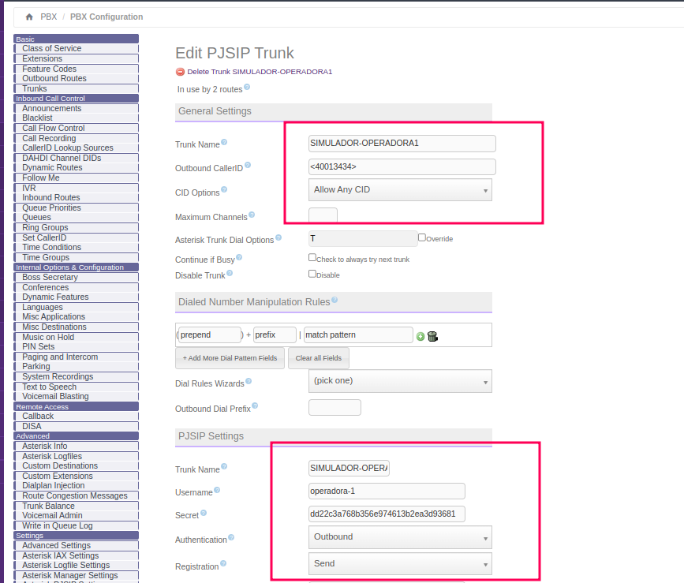
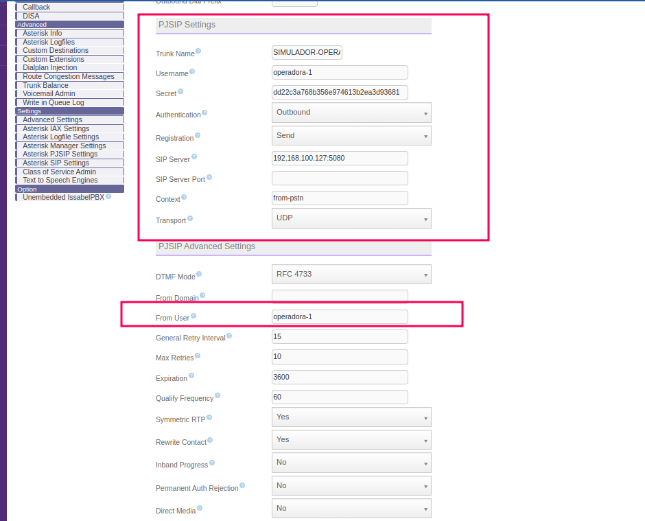
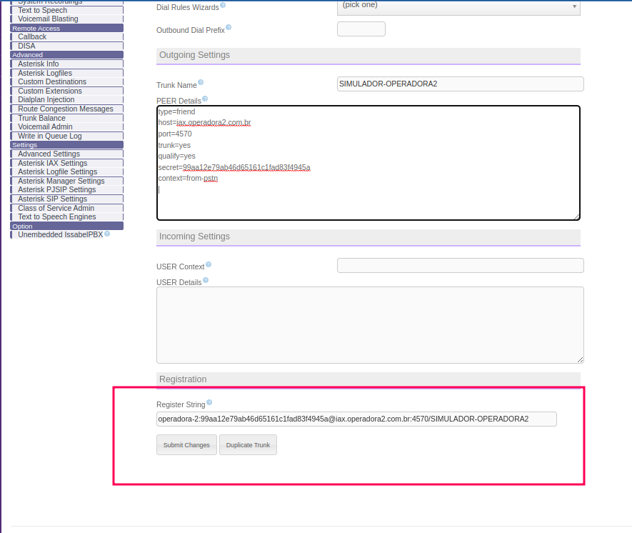

# Tronco SIP


# Tronco PJSIP 

 - Obs: no caso do PJSIP, é necessário que coloque o endereço ip da máquina onde o ```voip carrier simulator``` está sendo executado ao invés de ```sip.operadora1.com.br``` pois o PJSIP não lê o arquivo ```/etc/hosts```.
  




# Tronco IAX2




# Rotas de saída

 - **Números para sair pelas 2 operadoras (transbordo)**


- **Números para sair pela operadora 1**


- **Números para sair pela operadora 2**
  


# Rotas de entrada

 - **Operadora 1**


 - **Operadora 2**


